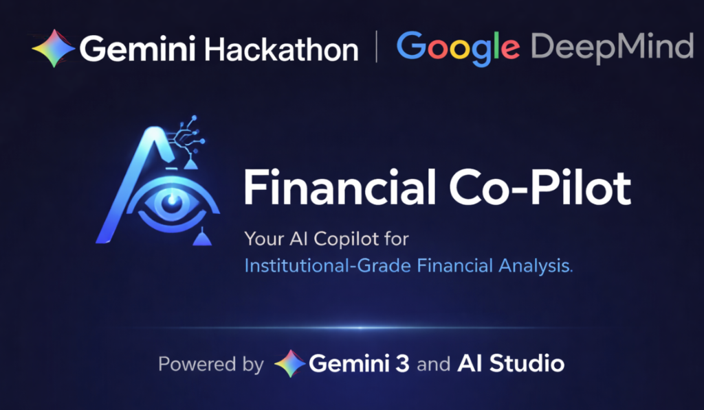

# 📊 Financial Co-Pilot



## Overview
**Financial Co-Pilot** is an AI-powered, institutional-grade financial analysis platform built with **Gemini 1.5 Flash** and **Google Cloud Platform (GCP)**. It empowers investors and analysts with deep-dive insights, real-time market data visualization, and automated document intelligence.

## 🚀 Key Features

*   **Financial News & Sentiment**: Real-time market news aggregation and sentiment analysis for any ticker.
*   **Technical & Fundamental Analysis**: Interactive charts and data visualizations powered by Yahoo Finance and Gemini.
*   **Document Intelligence**: Upload and analyze annual reports (10-Ks), SEC filings, and investment theses with multi-modal AI.
*   **Agentic Orchestration**: A multi-agent swarm (Market, Fundamental, and Document agents) coordinated to provide comprehensive intelligence.
*   **Cloud Native Storage**: Integrated with **Firestore** for chat history, **BigQuery** for activity logging, and **Cloud Storage** for document archiving.
*   **Real-time Notifications**: Automated analysis completion alerts via **Google Cloud Pub/Sub**.

## 🛠️ Technology Stack

*   **Frontend**: Streamlit (Premium institutional-grade design)
*   **LLM**: Google Gemini 3.0 Flash (via `google-generativeai`)
*   **Infrastructure**: Google Cloud Platform (Firestore, BigQuery, GCS, Pub/Sub, Cloud Run)
*   **Data Providers**: Yahoo Finance API, SEC EDGAR
*   **Language**: Python 3.11+

## 📥 Getting Started

### Prerequisites
*   Python 3.11 or higher
*   A Google Cloud Project with the following APIs enabled:
    *   Generative AI API
    *   Firestore API
    *   BigQuery API
    *   Cloud Storage API
    *   Pub/Sub API
*   A Gemini API Key

### Installation

1.  **Clone the repository**:
    ```bash
    git clone https://github.com/bgiriaicloud/finsight-co-pilot.git
    cd finsight-co-pilot
    ```

2.  **Create a virtual environment**:
    ```bash
    python -m venv venv
    source venv/bin/activate  # On Windows: venv\Scripts\activate
    ```

3.  **Install dependencies**:
    ```bash
    pip install -r requirements.txt
    ```

4.  **Configure Environment Variables**:
    Create a `.env` file in the root directory:
    ```env
    GEMINI_API_KEY=your_gemini_api_key
    GEMINI_MODEL=gemini-1.5-flash
    GOOGLE_CLOUD_PROJECT=your_project_id
    GCS_BUCKET_NAME=your_gcs_bucket_name
    GOOGLE_APPLICATION_CREDENTIALS=path/to/your/service-account.json
    ```

### Running the Application Locally
```bash
streamlit run main.py
```

## 🚢 Deployment
The project includes a `Dockerfile` and is pre-configured for **Google Cloud Run**. To deploy:
1.  Ensure you have the `gcloud` SDK installed and authenticated.
2.  Enable Artifact Registry and Cloud Build.
3.  (Optional) Use the provided `deploy.sh` script (tracked locally, see `.gitignore`).

---
*Built with ❤️ by the Financial Co-Pilot Team using Gemini AI.*
